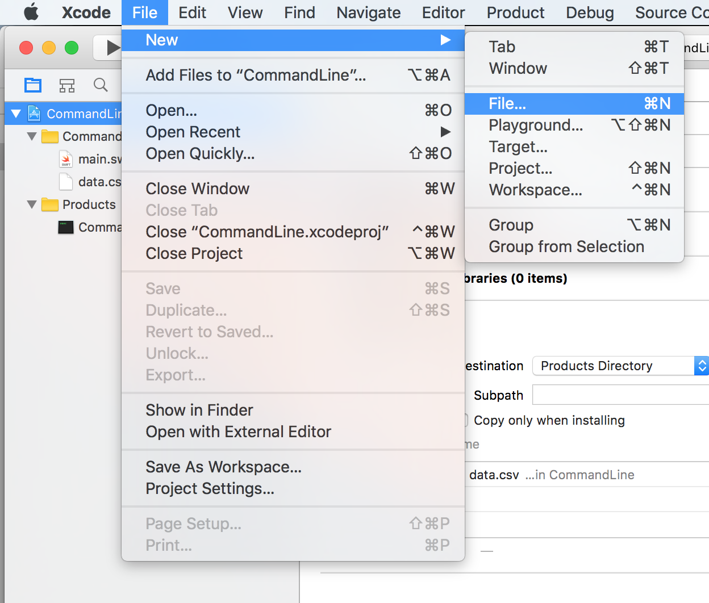
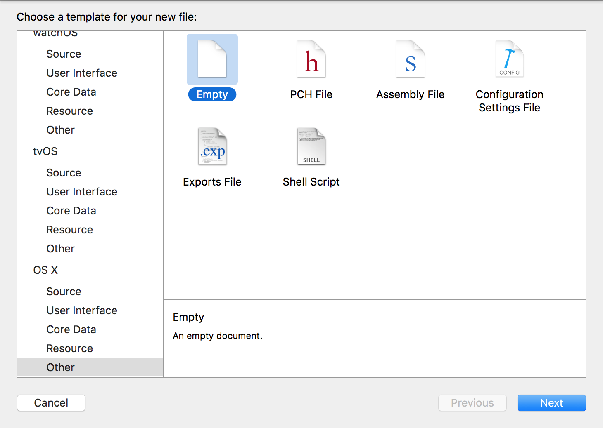
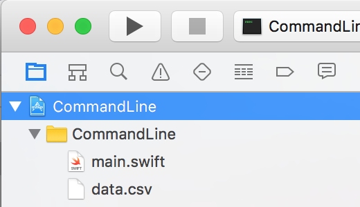
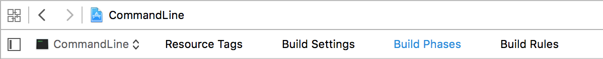
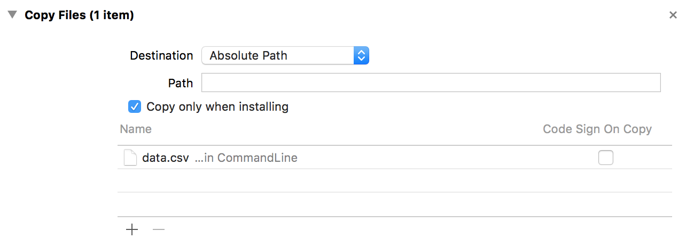
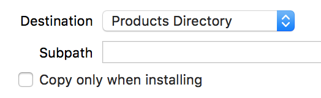

# Assignment 1

In this assignment, you'll make a command-line app that does the following things:

* Read a CSV file, which contains strings and numbers
* Divide the data into two groups
* Print a report based on these two groups to the console

## Details:

Given a text file containing this data:

    Shipment Type,Weight (t)
    Neptune Fuel,6
    Neptune Fuel,5
    Neptune Fuel,6
    Neptune Fuel,4
    Mars Food,3
    Neptune Fuel,10
    Mars Food,3
    Neptune Fuel,6
    Mars Food,10
    Neptune Fuel,8
    Mars Food,7
    Mars Food,2
    Mars Food,9
    Neptune Fuel,5
    Neptune Fuel,7
    Mars Food,8
    Mars Food,7
    Mars Food,9

The program should produce the following output:

    Mars Food: 58
    Neptune Fuel: 57
    
### Notes

* The first line of the data simply describes the content - it doesn't contain data to use.
* The application should error if it encounters any data besides "Mars Food" and "Neptune Fuel".
* The numbers in the data are always integers.

## Some tools

Here are some useful tips that can help you to build this program.

### How to add a text file

Open the File menu, and choose New -> New File.

Scroll down to the OS X section, and choose Empty File.

Name the new file data.csv.

### How to make sure the text file is in the same folder as your built product

Select the Project at the top of the Project navigator.

Choose Build Phases at the top of the window.

Open the Copy File section, and drag the file into the list.

Turn off **Copy only when installing**, and set the **Destination** to *Products Directory*.

When you build and run the program, the file will be copied into the same directory as the compiled program.

### How to open a file

Use the `contentsOfFile` initialiser for `String`:

    String(contentsOfFile: "data.csv")
    
Note that this returns an optional!

### How to split a string

Use the `componentsSeparatedByString` method on a string:

    data.componentsSeparatedByString("\n")
    
Note that not all text files end their lines with \n! A better option is to use the `NSCharacterSet` class and the `componentsSeparatedByCharactersInSet`:

    let newlineCharacterSet = NSCharacterSet.newlineCharacterSet()

    data.componentsSeparatedByCharactersInSet(newlineCharacterSet)

### How to convert a `String` to an `Int`

Pass the string to the `Int`'s initialiser:

    let theInt = Int("42")

Note that this returns an optional, because the string might not contain an int!
